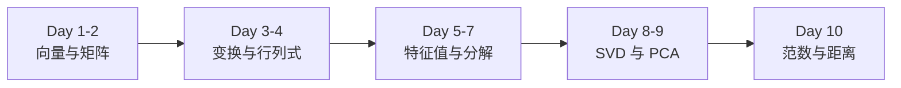
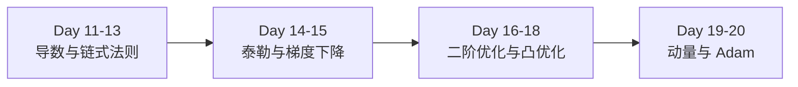
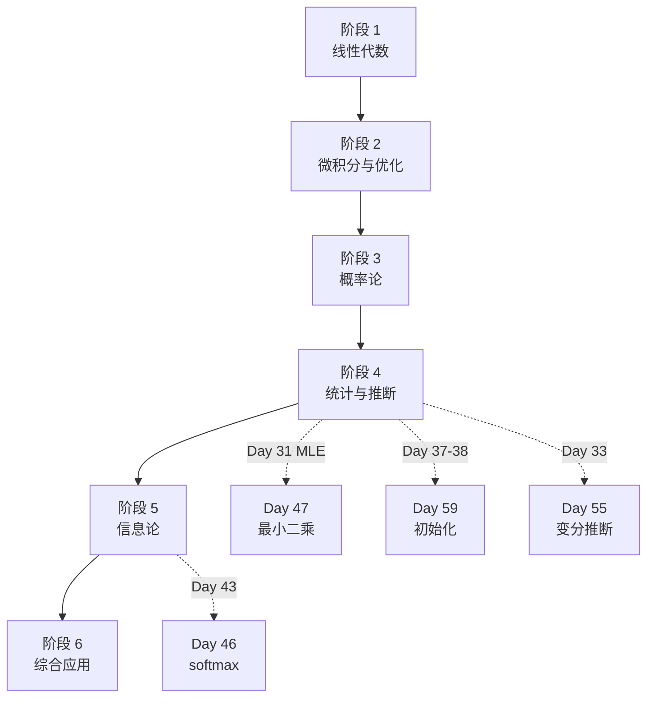

# 📐 AI 数学基础 60 天学习计划

_从线性代数到 Transformer 的完整数学体系_

---

## 📊 课程简介

这是一套完整的 AI 数学基础知识体系，涵盖从线性代数到 Transformer 的所有核心数学概念。

| 项目 | 详情 |
|------|------|
| **总知识点** | 60 个 |
| **学习周期** | 60 天（每天 1 个知识点） |
| **适合人群** | AI 从业者、深度学习学习者、想夯实数学基础的工程师 |
| **前置要求** | 高中数学基础 |

---

## 🗓️ 六大阶段

### 阶段 1：线性代数基础（Day 1-10）

AI 的数学语言 - 向量、矩阵、变换、分解

**核心知识点**：
- Day 1-2: 向量、矩阵运算
- Day 3-4: 线性变换、行列式
- Day 5-7: 逆矩阵、特征值、特征分解
- Day 8-9: SVD、PCA
- Day 10: 范数与距离

📖 [开始学习阶段 1](#/docs/stage1)

---

### 阶段 2：微积分与优化（Day 11-20）

神经网络如何学习 - 导数、梯度、优化算法

**核心知识点**：
- Day 11-13: 导数、梯度、链式法则（反向传播核心）
- Day 14-15: 泰勒展开、梯度下降
- Day 16-18: 牛顿法、拉格朗日、凸优化
- Day 19-20: SGD 动量、Adam 优化器

📖 [开始学习阶段 2](#/docs/stage2)

---

### 阶段 3：概率论基础（Day 21-30）

理解不确定性和随机性

**核心知识点**：
- Day 21-22: 概率、贝叶斯定理
- Day 23-25: 随机变量、分布、期望方差
- Day 26-28: 协方差、大数定律、中心极限定理
- Day 29-30: 联合分布、条件独立性

📖 [开始学习阶段 3](#/docs/stage3)

---

### 阶段 4：统计与推断（Day 31-40）

从数据中学习参数和做出推断

**核心知识点**：
- Day 31-33: MLE、MAP、贝叶斯推断
- Day 34-36: 假设检验、置信区间、回归分析
- Day 37-38: 过拟合、正则化
- Day 39-40: 交叉验证、Bootstrap

📖 [开始学习阶段 4](#/docs/stage4)

---

### 阶段 5：信息论基础（Day 41-45）

度量信息和不确定性

**核心知识点**：
- Day 41-42: 信息量、熵
- Day 43-44: 交叉熵、KL 散度
- Day 45: 互信息

📖 [开始学习阶段 5](#/docs/stage5)

---

### 阶段 6：综合与应用（Day 46-60）

AI 模型和算法的数学基础

**核心知识点**：
- Day 46-48: softmax、最小二乘、sigmoid
- Day 49-52: 拉普拉斯平滑、EM 算法、马尔可夫链、HMM
- Day 53-55: 蒙特卡洛、MCMC、变分推断
- Day 56-57: 注意力机制、位置编码
- Day 58-60: 归一化、初始化、学习率调度

📖 [开始学习阶段 6](#/docs/stage6)

---

## 📈 知识依赖图

---

## 📚 学习路径建议

### 🎯 标准路径（60 天）

| 阶段 | 天数 | 每天投入 | 总时长 |
|------|------|---------|--------|
| 阶段 1 | Day 1-10 | 30-60 分钟 | 5-10 小时 |
| 阶段 2 | Day 11-20 | 30-60 分钟 | 5-10 小时 |
| 阶段 3 | Day 21-30 | 30-60 分钟 | 5-10 小时 |
| 阶段 4 | Day 31-40 | 30-60 分钟 | 5-10 小时 |
| 阶段 5 | Day 41-45 | 30-60 分钟 | 2.5-5 小时 |
| 阶段 6 | Day 46-60 | 30-60 分钟 | 7.5-15 小时 |

**适合**：有微积分和线性代数基础的学习者

---

### 🚀 加速路径（30 天）

每天学习 2 个知识点，适合有较好数学基础的学习者。

**分组建议**：
- Day 1-2: 向量与矩阵
- Day 3-4: 线性变换与行列式
- ...（详见 [学习路径](#/docs/learning-path)）

---

### 🐢 深入路径（90 天）

每知识点 1.5 天，额外时间用于：
- ✍️ 推导练习：关键公式手动推导
- 💻 代码实现：用 NumPy 实现核心算法
- 📖 扩展阅读：教材和论文
- 📝 习题练习：完成思考题

---

## 💡 使用建议

✅ **应该做的**

1. **按顺序学习**：不要跳跃，前面是后面的基础
2. **理解优先**：不要死记硬背，理解几何直观
3. **动手推导**：关键公式手动推导至少一遍
4. **联系 AI**：时刻思考这个知识点在 AI 中哪里用到
5. **间隔复习**：利用遗忘曲线，定期回顾

❌ **应该避免的**

1. **跳跃学习**：前面没理解就往后看
2. **只看不练**：不推导公式，不写代码实现
3. **追求完美**：某些细节可以先跳过
4. **孤立学习**：不联系 AI 应用，纯学数学
5. **急于求成**：数学需要时间沉淀

---

## 📖 配套资源

- 📄 [完整学习路径与知识依赖图](#/docs/learning-path)
- 📝 [知识卡片原文（GitHub）](https://github.com/你的仓库/ai-math-knowledge-map.md)
- 📚 [推荐教材与资源](#/docs/learning-path#推荐教材)

---

## 🎓 快速开始

选择你的起点：

| 基础 | 建议起点 |
|------|---------|
| **零基础** | 从 [阶段 1 Day 1](#/docs/stage1#day-1-向量与向量空间) 开始 |
| **有线性代数基础** | 从 [阶段 2 Day 11](#/docs/stage2#day-11-导数与偏导数) 开始 |
| **有微积分基础** | 从 [阶段 3 Day 21](#/docs/stage3#day-21-概率与条件概率) 开始 |
| **只想学 Transformer 数学** | 从 [阶段 6 Day 56](#/docs/stage6#day-56-注意力机制的数学) 开始 |

---

## 📞 反馈与交流

如有问题或建议，欢迎交流讨论！

---

*最后更新：2026-04-22*  
*创建者：悟空 AI 助手*
