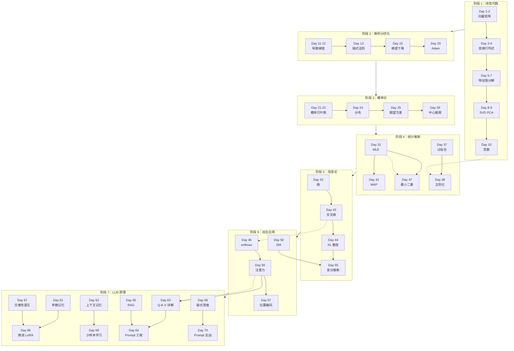

# 学习路径与知识依赖图

_70 天数学+LLM 原理卡片体系的完整知识图谱_

---

## 📊 知识依赖图

---

## 📚 学习路径建议

### 🎯 标准路径（70 天）

| 阶段 | Day 范围 | 天数 | 每天投入 | 总时长 |
|------|---------|------|---------|--------|
| 阶段 1 | Day 1-10 | 10 天 | 30-60 分钟 | 5-10 小时 |
| 阶段 2 | Day 11-20 | 10 天 | 30-60 分钟 | 5-10 小时 |
| 阶段 3 | Day 21-30 | 10 天 | 30-60 分钟 | 5-10 小时 |
| 阶段 4 | Day 31-40 | 10 天 | 30-60 分钟 | 5-10 小时 |
| 阶段 5 | Day 41-45 | 5 天 | 30-60 分钟 | 2.5-5 小时 |
| 阶段 6 | Day 46-60 | 15 天 | 30-60 分钟 | 7.5-15 小时 |
| 阶段 7 | Day 61-70 | 10 天 | 30-60 分钟 | 5-10 小时 |

**总计**：70 天，35-55 小时

---

### 🚀 加速路径（35 天）

每 2 天学习一个知识点，适合有基础的学习者。

---

### 🐢 深入路径（105 天）

每知识点 1.5 天，额外时间用于推导练习和代码实现。

---

## 🔗 关键依赖关系

| 知识点 | 前置依赖 | 后续应用 |
|--------|---------|---------|
| **Day 38 正则化** | Day 10 范数、Day 37 过拟合 | Day 59 初始化、Day 67 灾难性遗忘 |
| **Day 46 softmax** | Day 43 交叉熵、Day 13 链式法则 | Day 56 注意力 |
| **Day 47 最小二乘** | Day 31 MLE、Day 24 高斯分布 | Day 58 归一化 |
| **Day 50 EM 算法** | Day 31 MLE、Day 29 联合分布 | Day 55 变分推断 |
| **Day 55 变分推断** | Day 44 KL 散度、Day 50 EM | - |
| **Day 56 注意力** | Day 46 softmax、Day 1-2 向量矩阵 | Day 57 位置编码、Day 63 Q-K-V |
| **Day 63 Q-K-V** | Day 56 注意力、Day 1 向量点积 | Day 64 Prompt 工程 |
| **Day 64 Prompt** | Day 63 Q-K-V、Day 42 熵 | Day 70 Prompt 实战 |
| **Day 65 RAG** | Day 1 向量相似度、Day 9 PCA | Day 64 Prompt 工程 |
| **Day 66 LoRA** | Day 15 梯度下降、Day 5 伪逆 | Day 67 灾难性遗忘 |

---

## 📖 推荐教材

### 综合教材
- 《深度学习》花书 - 第 3-6 章
- 《Pattern Recognition and Machine Learning》Bishop

### 线性代数
- 《Introduction to Linear Algebra》Gilbert Strang
- 3Blue1Brown 线性代数本质

### 微积分与优化
- 《Convex Optimization》Stephen Boyd

### 概率与统计
- 《概率论与数理统计》陈希孺
- 《All of Statistics》Larry Wasserman

### 信息论
- 《Elements of Information Theory》Cover

### LLM 原理
- 《Attention Is All You Need》Transformer 原论文
- 《Language Models are Few-Shot Learners》GPT-3 论文

---

## 💡 学习建议

✅ **应该做的**

1. 按顺序学习，不要跳跃
2. 理解优先，不要死记硬背
3. 动手推导关键公式
4. 联系 AI 应用场景
5. 间隔复习

❌ **应该避免的**

1. 前面没理解就往后看
2. 只看不练
3. 追求完美
4. 孤立学习
5. 急于求成

---

*最后更新：2026-04-22*
