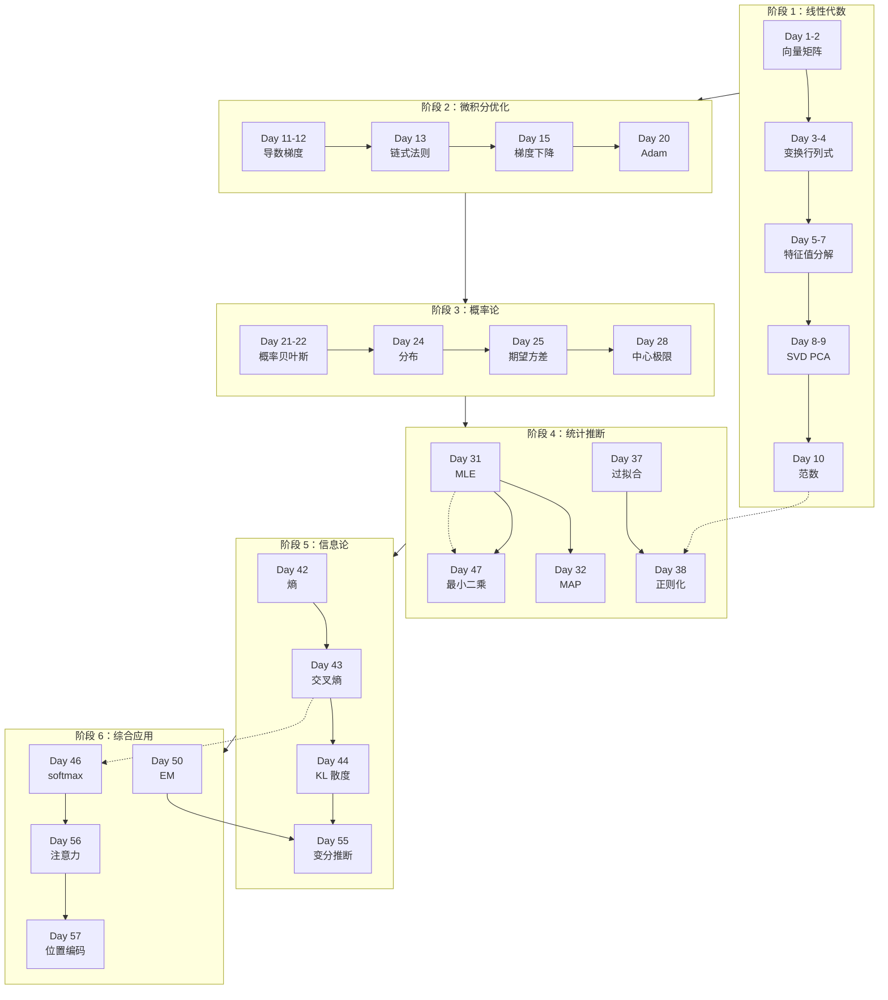

# 学习路径与知识依赖图

_60 天数学卡片体系的完整知识图谱_

---

## 📊 知识依赖图

---

## 📚 学习路径建议

### 🎯 标准路径（60 天）

| 阶段 | Day 范围 | 天数 | 每天投入 | 总时长 |
|------|---------|------|---------|--------|
| 阶段 1 | Day 1-10 | 10 天 | 30-60 分钟 | 5-10 小时 |
| 阶段 2 | Day 11-20 | 10 天 | 30-60 分钟 | 5-10 小时 |
| 阶段 3 | Day 21-30 | 10 天 | 30-60 分钟 | 5-10 小时 |
| 阶段 4 | Day 31-40 | 10 天 | 30-60 分钟 | 5-10 小时 |
| 阶段 5 | Day 41-45 | 5 天 | 30-60 分钟 | 2.5-5 小时 |
| 阶段 6 | Day 46-60 | 15 天 | 30-60 分钟 | 7.5-15 小时 |

**总计**：60 天，30-50 小时

---

### 🚀 加速路径（30 天）

| 天数 | 学习内容 | 知识点 |
|------|---------|--------|
| Day 1 | 向量与矩阵 | Day 1-2 |
| Day 2 | 线性变换与行列式 | Day 3-4 |
| Day 3 | 逆矩阵与特征值 | Day 5-6 |
| Day 4 | 特征分解与 SVD | Day 7-8 |
| Day 5 | PCA 与范数 | Day 9-10 |
| Day 6 | 导数与梯度 | Day 11-12 |
| Day 7 | 链式法则与泰勒 | Day 13-14 |
| Day 8 | 梯度下降与牛顿法 | Day 15-16 |
| Day 9 | 拉格朗日与凸优化 | Day 17-18 |
| Day 10 | 动量与 Adam | Day 19-20 |
| Day 11 | 概率与贝叶斯 | Day 21-22 |
| Day 12 | 随机变量与分布 | Day 23-24 |
| Day 13 | 期望方差与协方差 | Day 25-26 |
| Day 14 | 大数定律与中心极限 | Day 27-28 |
| Day 15 | 联合分布与条件独立 | Day 29-30 |
| Day 16 | MLE 与 MAP | Day 31-32 |
| Day 17 | 贝叶斯推断与假设检验 | Day 33-34 |
| Day 18 | 置信区间与回归 | Day 35-36 |
| Day 19 | 过拟合与正则化 | Day 37-38 |
| Day 20 | 交叉验证与 Bootstrap | Day 39-40 |
| Day 21 | 自信息与熵 | Day 41-42 |
| Day 22 | 交叉熵与 KL 散度 | Day 43-44 |
| Day 23 | 互信息 | Day 45 + 复习 |
| Day 24 | softmax 与最小二乘 | Day 46-47 |
| Day 25 | sigmoid 与拉普拉斯平滑 | Day 48-49 |
| Day 26 | EM 算法与马尔可夫链 | Day 50-51 |
| Day 27 | HMM 与蒙特卡洛 | Day 52-53 |
| Day 28 | MCMC 与变分推断 | Day 54-55 |
| Day 29 | 注意力与位置编码 | Day 56-57 |
| Day 30 | 归一化、初始化、学习率 | Day 58-60 |

---

### 🐢 深入路径（90 天）

**额外时间用于**：

1. **推导练习**：每张卡片的关键公式手动推导
2. **代码实现**：用 NumPy 实现核心算法
3. **扩展阅读**：阅读教材和论文
4. **习题练习**：完成思考题

**推荐资源**：

| 主题 | 资源 |
|------|------|
| 线性代数 | Gilbert Strang MIT 18.06 |
| 微积分 | 3Blue1Brown 微积分本质 |
| 概率论 | 《概率论与数理统计》陈希孺 |
| 优化 | 《Convex Optimization》Boyd |
| 信息论 | 《Elements of Information Theory》Cover |

---

## 🔗 关键依赖关系

| 知识点 | 前置依赖 | 后续应用 |
|--------|---------|---------|
| **Day 38 正则化** | Day 10 范数、Day 37 过拟合 | Day 59 初始化 |
| **Day 46 softmax** | Day 43 交叉熵、Day 13 链式法则 | Day 56 注意力 |
| **Day 47 最小二乘** | Day 31 MLE、Day 24 高斯分布 | Day 58 归一化 |
| **Day 50 EM 算法** | Day 31 MLE、Day 29 联合分布 | Day 55 变分推断 |
| **Day 55 变分推断** | Day 44 KL 散度、Day 50 EM | - |
| **Day 56 注意力** | Day 46 softmax、Day 1-2 向量矩阵 | - |

---

## 📖 推荐教材

### 综合教材
- 《深度学习》花书 - 第 3-6 章
- 《Pattern Recognition and Machine Learning》Bishop

### 线性代数
- 《Introduction to Linear Algebra》Gilbert Strang
- 3Blue1Brown 线性代数本质

### 微积分与优化
- 《Convex Optimization》Stephen Boyd

### 概率与统计
- 《概率论与数理统计》陈希孺
- 《All of Statistics》Larry Wasserman

### 信息论
- 《Elements of Information Theory》Thomas Cover

---

## 💡 学习建议

✅ **应该做的**

1. 按顺序学习，不要跳跃
2. 理解优先，不要死记硬背
3. 动手推导关键公式
4. 联系 AI 应用场景
5. 间隔复习

❌ **应该避免的**

1. 前面没理解就往后看
2. 只看不练
3. 追求完美
4. 孤立学习
5. 急于求成

---

*最后更新：2026-04-22*
